# Hungry Flutter App 🍔

A modern food ordering mobile application built using **Flutter** and connected to a real **REST API**.

The app focuses on delivering a smooth user experience while handling real-world scenarios such as API integration, local storage, and UI performance.

---

## 🚀 Features

- Smooth splash screen experience with animations
- Authentication flow (Login / Sign up)
- Browse food items from API
- Product details with customization options:
  - Spice level
  - Toppings
  - Side options
- Add to cart functionality
- Cart & checkout flow
- Order history (demo)
- Skeleton loading for better UX during API calls
- Clean and responsive UI

---

## 🛠 Tech Stack

- **Flutter**
- **Dio** (API handling & networking)
- **REST APIs**
- **SharedPreferences** (local storage)
- **Animations**

---

## 📱 Screenshots

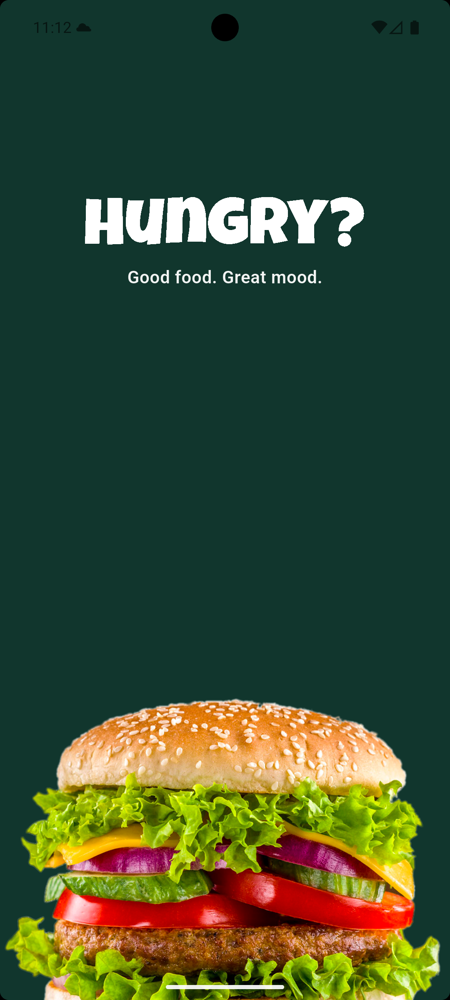
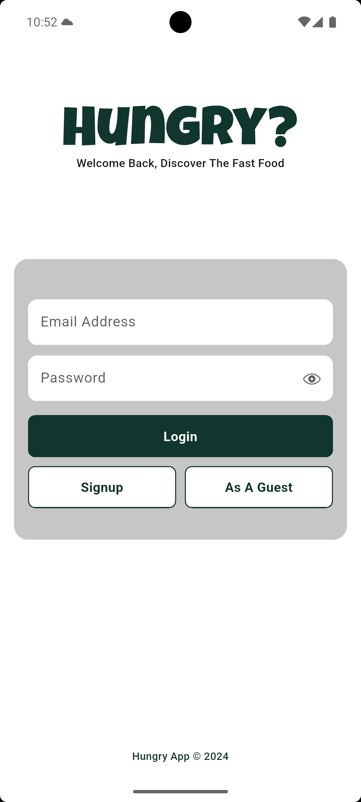
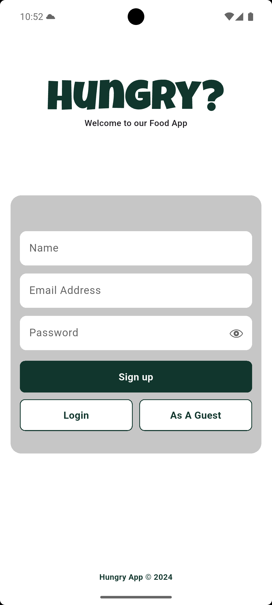

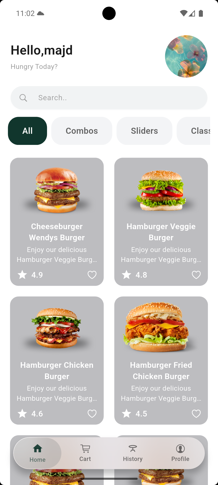
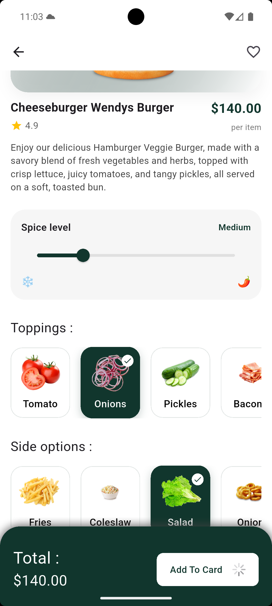
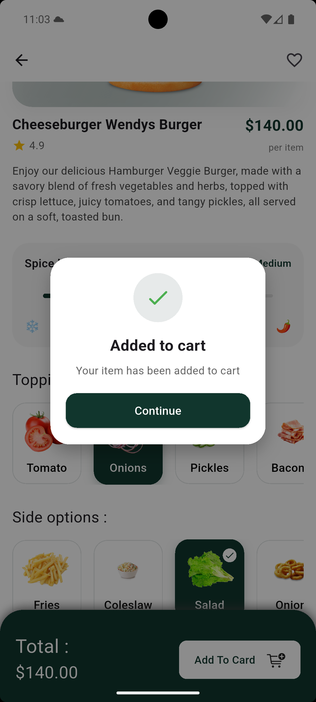

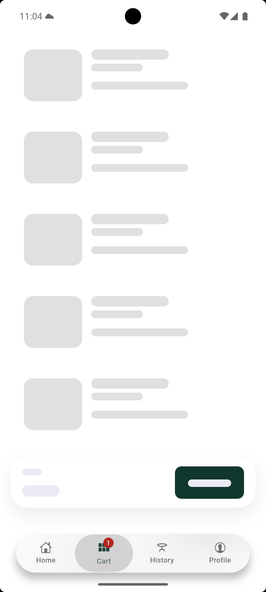
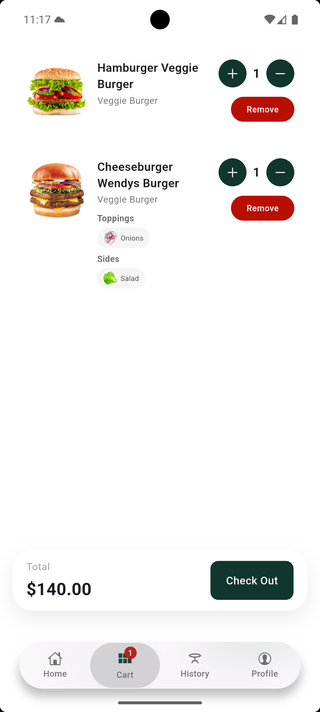
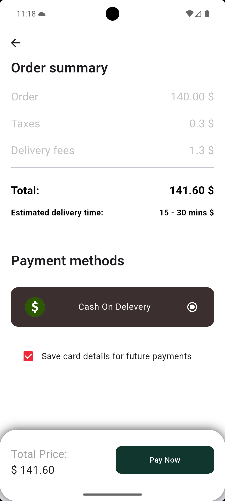

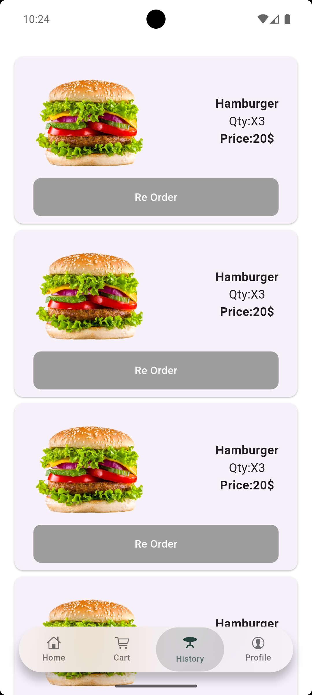
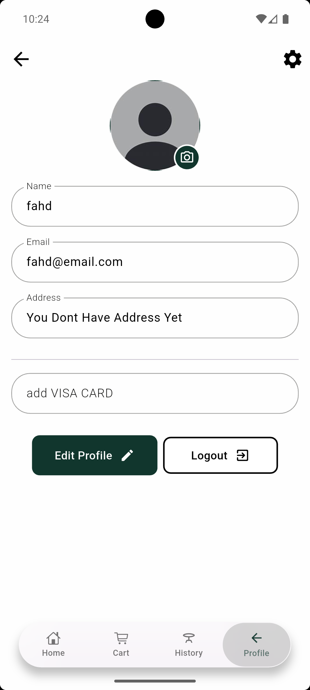
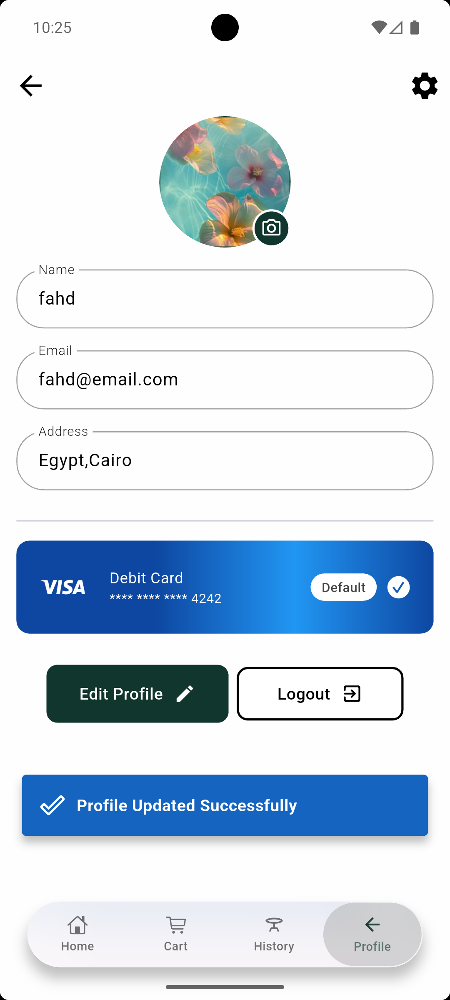

---

## ⚠️ Notes

- The API used is for demo/testing purposes (public/free API).
- Some features like order history are simulated.

---

## 💡 What I Learned

- Working with real-world REST APIs using Dio
- Handling loading, error, and empty states
- Managing local data using SharedPreferences
- Building scalable and maintainable UI in Flutter

## Tech Stack
- Flutter
- REST API
- Dio
- SharedPreferences

## Notes
- API used for demo/testing purposes, performance may vary (free/public API).
